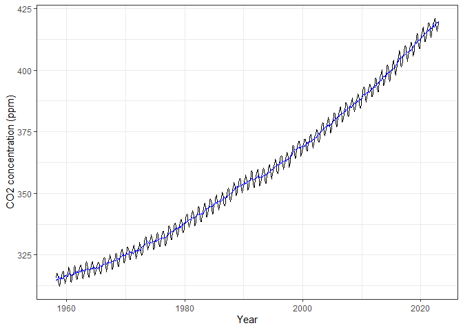
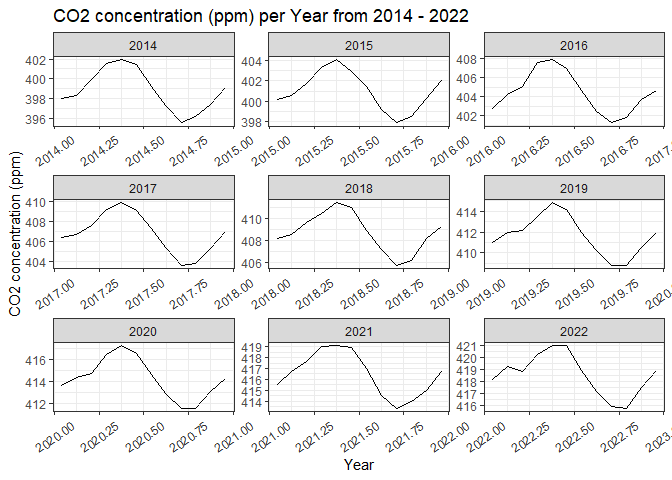
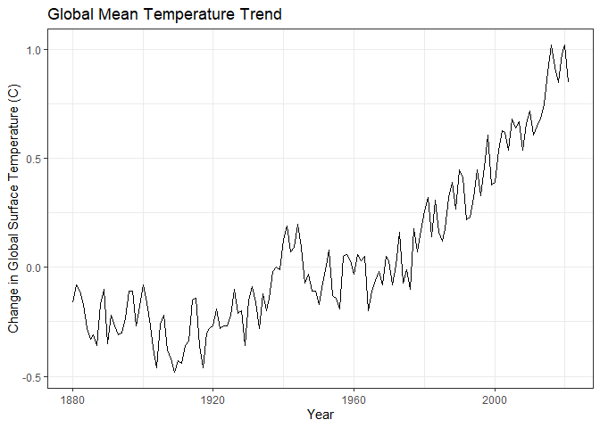
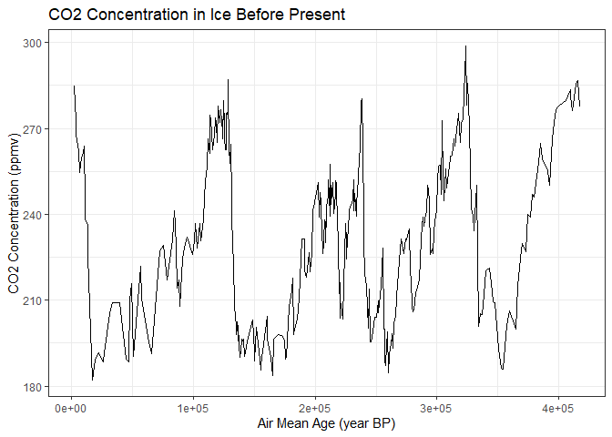
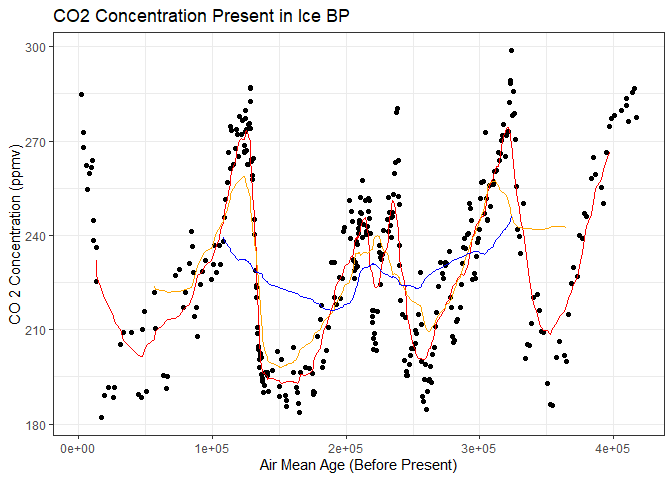
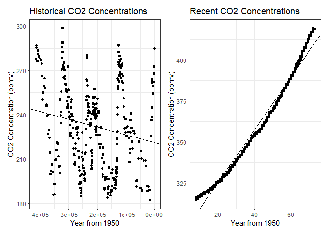
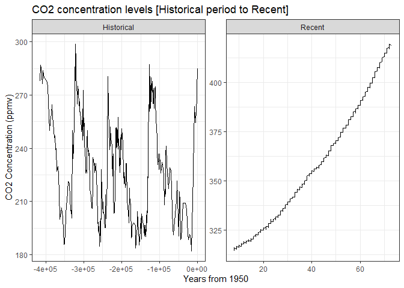

Climate Change Module
================
Quinn Thomas

``` r
library(tidyverse)
```

## Warm-up: Examining CO2 trends in R

- Example from <http://climate.nasa.gov/vital-signs/carbon-dioxide/>
- Raw data from
  <https://gml.noaa.gov/webdata/ccgg/trends/co2/co2_mm_mlo.txt>

In 1958, Dr. Charles David Keeling (1928-2005), who was a scientist at
Scripps Institute of Oceanography, began collecting data on atmospheric
CO2 concentration at the Mauna Loa Observatory located in Hawaii. This
dataset is what allowed us to understand the degree to which climate
change is human-caused through our burning of fossil fuels and release
of CO2 into the atmosphere. Due to his scientific achievements,
Dr. Keeling was awarded the National Medal of Science by President
George W. Bush in 2002. This is the highest award for lifetime
scientific achievement that can be granted in the U.S. Today, you get to
analyze this same dataset, except that you have more data that was
available to Dr. Keeling and his colleagues, because your dataset
extends up to current time.

``` r
co2 <- 
read_table("https://gml.noaa.gov/webdata/ccgg/trends/co2/co2_mm_mlo.txt", 
                  comment="#",
                  col_names = c("year", "month", "decimal_date", "monthly_average",
                                "deseasonalized", "days", "sd_days","unc_month_mean"),
                  na = c("-1", "-99.99"))
```

``` r
ggplot(co2, aes(x = decimal_date, y = monthly_average)) + 
  geom_line() + 
  geom_line(aes(y = deseasonalized), color = "blue") +
  labs(x = "Year", 
       y = "CO2 concentration (ppm)") +
  theme_bw()
```

<!-- -->

**Question 1:**

Describe the overall trend in the CO2 data.

**Answer 1: when plotting the monthly average CO2 concentrations (black
solid line), the overall direction of CO2 concentrations is increasing;
however, within each year, there are oscillations present, most likely
representing seasons. Since seasons have widely different conditions
(temperature, precipitation, light duration, etc), the oscillations seen
are most likely due to these characteristics. When the data is smoothed
out, by averaging the seasonal data for each year so the data is
“deseasonalized”, a clear linear increase can be seen (solid blue line)
further indicating a positive direct relationship between year and CO2
concentrations. **

**Question 2:**

How does CO2 vary within a year? What month is it at max? Min? What
might explain this sub-annual pattern?

**Answer 2: In order to visualize the CO2 variations within a singular
year, the CO2 concentrations of the years 2014 to 2022 were plotted and
separated by year. All 9 plots show a very similiar trend/shape with the
CO2 concentration increasing until around the first quarter of the year,
where the concentration peaks, and then decreasing at relatively the
same rate until the 3rd quarter of the year occurs, before finally
increasing to a little more than the CO2 concentration as the beginning
of the year. When examining the max and min CO2 concentrations of the
whole data, May and June had the extreme maximum CO2 concentration while
October had the extreme minimum. When examining the average of monthly
averages of all years, May had the highest average with the surrounding
months being second and third highest. **

``` r
#CO2 variation within a year between 2014 and 2023
co2 |> filter(year >= 2014 & year < 2023) |> 
  ggplot(aes(x = decimal_date, y = monthly_average)) + 
  geom_line() +
  theme_bw() +
  labs(x = "Year", 
       y = "CO2 concentration (ppm)",
       title= "CO2 concentration (ppm) per Year from 2014 - 2022") +
  facet_wrap(~year, scales = "free") + 
  theme(axis.text.x = element_text(color = "grey20",
                                   angle=35, 
                                   vjust=0.5, 
                                   hjust=0.5))
```

<!-- -->

``` r
#Month Max & Min (group_by)
co2 |>  group_by(month) |>  summarize(maxco2 = max(monthly_average, na.rm = TRUE))
```

    ## # A tibble: 12 × 2
    ##    month maxco2
    ##    <dbl>  <dbl>
    ##  1     1   419.
    ##  2     2   419.
    ##  3     3   419.
    ##  4     4   420.
    ##  5     5   421.
    ##  6     6   421.
    ##  7     7   419.
    ##  8     8   417.
    ##  9     9   416.
    ## 10    10   416.
    ## 11    11   418.
    ## 12    12   419.

``` r
co2 |>  group_by(month) |>  summarize(minco2 = min(monthly_average, na.rm = TRUE))
```

    ## # A tibble: 12 × 2
    ##    month minco2
    ##    <dbl>  <dbl>
    ##  1     1   316.
    ##  2     2   316.
    ##  3     3   316.
    ##  4     4   317.
    ##  5     5   318.
    ##  6     6   317.
    ##  7     7   316.
    ##  8     8   315.
    ##  9     9   313.
    ## 10    10   312.
    ## 11    11   313.
    ## 12    12   315.

``` r
co2 |>  group_by(month) |>  summarize(meanco2 = mean(monthly_average, na.rm = TRUE))
```

    ## # A tibble: 12 × 2
    ##    month meanco2
    ##    <dbl>   <dbl>
    ##  1     1    359.
    ##  2     2    358.
    ##  3     3    359.
    ##  4     4    360.
    ##  5     5    360.
    ##  6     6    360.
    ##  7     7    358.
    ##  8     8    356.
    ##  9     9    355.
    ## 10    10    355.
    ## 11    11    356.
    ## 12    12    358.

## Global Temperature Data

Current climate change is affecting many aspects of the environment,
with socio-economic consequences. For example, a warmer climate can
allow new diseases to be introduced and persist (e.g. West Nile became
established in the United States after an unusually warm winter allowed
the mosquitoes that carry the virus to survive and spread). We are
concerned not only with the actual temperature, but also with the rate
that the temperature changes. Very rapid changes make it more likely
that species cannot adapt and will go extinct.

Each of the most recent years have the warmest on record. In this
section we will analyze global mean temperature data.

Data from: <http://climate.nasa.gov/vital-signs/global-temperature>

**Question 3:**

Describe the data set to the best of your ability given the
documentation provided. Describe what kind of column each data contains
and what units it is measured in. Then address our three key questions
in understanding this data:

- How are the measurements made? What is the associated measurement
  uncertainty?
- What is the spatial resolution of the data? What is the temporal
  resolution of the data?
- Are there missing values? How should they be handled?

**Answer 3: This data set contains the change in global land-ocean
temperature that occurred each year from 1880 to 2021, which were
provided by NASA’s Goddard Institute for Space Studies (GISS). There are
two columns that contain change in temperature data with one being the
actual average change in global temperature of the year and the other
being the smoothed average change in global temperature of the year by 5
years. There is no stated uncertainty; however, NASA’s analyses
typically matched the independent studies by two other organizations:
the Climatic Research Unit and the National Oceanic and Atmospheric
Administration (NOAA). The spatial resolution came from satellite data,
I assume since NASA was the organization that collected this data, and
the temporal resolution was each year. It also does not appear that
there are any missing values in this dataset. **

**Question 4:**

Construct the necessary R code to import and prepare for plotting the
following data set:
<http://climate.nasa.gov/system/internal_resources/details/original/647_Global_Temperature_Data_File.txt>

**Answer 4: See code block below. **

``` r
#read_table
global_temp <- read_table("http://climate.nasa.gov/system/internal_resources/details/original/647_Global_Temperature_Data_File.txt", skip = 5, col_names = c("year", "gst_change", "lowess"))
```

    ## 
    ## ── Column specification ────────────────────────────────────────────────────────
    ## cols(
    ##   year = col_double(),
    ##   gst_change = col_double(),
    ##   lowess = col_double()
    ## )

**Question 5:**

Plot the trend in global mean temperatures over time. Describe what you
see in the plot and how you interpret the patterns you observe.

**Answer 5: When the plot is examined, it can be seen that average
global surface temperature change is oscillating back and forth between
small time frames, but typically increasing in overall trend. The
oscillations appear to be constant around up until 1920 when the average
change increases. The changes seem to level out until 1980 before
rapidly increasing until 2021. I believe the oscillations may be due to
the changing seasons or other factors. Either way, it is hard to analyze
the overall trend, so the smoothed average for 5 years was plotted along
the originial data. This way, the small decrease in the beginning and
overall increase in the years following can be seen more clearly. **

``` r
#just global surface temperature change
ggplot(global_temp, aes(year, gst_change)) + 
  geom_line() + 
  theme_bw() +
  labs(x = "Year", 
       y = "Change in Global Surface Temperature (C)", 
       title = "Global Mean Temperature Trend")
```

<!-- -->

``` r
#global surface temperature change with smoothed average
global_temp |> ggplot(aes(year, gst_change)) + 
  geom_point() + 
  geom_line(aes(year, lowess)) + 
  theme_bw() +
  labs(x = "Year", 
       y = "Change in Global Surface Temperature (C)", 
       title = "Global Mean Temperature Trend")
```

<!-- -->

## Evaluating the evidence for a “Pause” in warming?

The [2013 IPCC
Report](https://www.ipcc.ch/pdf/assessment-report/ar5/wg1/WG1AR5_SummaryVolume_FINAL.pdf)
included a tentative observation of a “much smaller increasing trend” in
global mean temperatures since 1998 than was observed previously. This
led to much discussion in the media about the existence of a “Pause” or
“Hiatus” in global warming rates, as well as much research looking into
where the extra heat could have gone. (Examples discussing this question
include articles in [The
Guardian](http://www.theguardian.com/environment/2015/jun/04/global-warming-hasnt-paused-study-finds),
[BBC News](http://www.bbc.com/news/science-environment-28870988), and
[Wikipedia](https://en.wikipedia.org/wiki/Global_warming_hiatus)).

You will use rolling averages to help you explore the evidence for a
pause. You have not been provided instructions for calculating rolling
means so a learning objective of this question is to practicing finding
the solution.

**Question 6:**

Use a search engine (e.g., Google), to search for how to calculate a
rolling average in R. What search term did you use and what website did
you end up using? Why did you select this particular website?

**Answer 6: I searched “rolling averages in r” because I hoped to get a
website that would first tell me what they are and their purpose, and
then tell me how to calculate them in R. After searching this, I can
across this site (<https://www.statology.org/rolling-average-in-r/>)
titled “How to Calculate a Rolling Average in R (With Example)” which I
chose because I could tell that it included the definition, how to
calculate rolling averages, and had specific R codes I could use as a
reference. **

**Question 7:**

- What is the meaning of “5 year average” vs “annual average”?
- Create a data frame from the annual data with three new columns:
  5-year running averages, 10-year running averages, and 20-year running
  averages.

**Answer 7: Annual average refers to taking the mean of the data
collected within one year. A 5-yr average refers to taking the mean of
the data collected within 5 years, typically the current year and the 4
years before, but there are other ways to stagger the average as well.
**

``` r
#installing libraries
library(dplyr)
#install.packages("zoo")
library(zoo)
```

    ## 
    ## Attaching package: 'zoo'

    ## The following objects are masked from 'package:base':
    ## 
    ##     as.Date, as.Date.numeric

``` r
#adding rolling averages
## 5 years
global_temp <- global_temp |> mutate(rolling_ave5 = rollmean(gst_change, k = 5, fill = NA, align = "right"))
## 10 years
global_temp <- global_temp |> mutate(rolling_ave10 = rollmean(gst_change, k = 10, fill = NA, align = "right"))
## 20 years
global_temp <- global_temp |> mutate(rolling_ave20 = rollmean(gst_change, k = 20, fill = NA, align = "right"))
```

**Question 8:**

Plot the different averages on the same plot and describe what
differences you see and why.

**Answer 8: When the plot is examined, the three rolling average trends
can be compared to the original data. As the rolling average time period
increases, a clearer trend can be seen of the global surface temperature
changes increasing. This is because as the average is taken over a
longer period of time, extreme values or volatile values will be
smoothed over and less noticeable in plots, therefore resulting in a
clearer analysis. **

``` r
#plotting regular & rolling averages
global_temp |> ggplot(aes(year, gst_change)) + 
  geom_point() +
  geom_line(aes(year, rolling_ave5), color = "red") +
  geom_line(aes(year, rolling_ave10), color = "orange") +
  geom_line(aes(year, rolling_ave20), color = "blue") +
  theme_bw() +
  labs(x = "Year", 
       y = "Change in Global Surface Temperature (C)", 
       title = "Global Mean Temperature Trend")
```

    ## Warning: Removed 4 rows containing missing values (`geom_line()`).

    ## Warning: Removed 9 rows containing missing values (`geom_line()`).

    ## Warning: Removed 19 rows containing missing values (`geom_line()`).

<!-- -->

**Question 9:**

By examining the data here, what evidence do you find or not find for
such a pause?

**Answer 9: While “the pause” scientists were talking about could be
seen on the original graph (as a seemingly flat portion of the graph),
it can not be seen on the 20 year rolling average, and is less
noticeable on the other rolling average graphs as well. This is because,
when the data is averaged over a longer period of time, volatile data is
less likely to affect the plot and trends can be viewed more accurately.
**

## Longer term trends in CO2 Records

When analyzing Earth’s climate, it is important to remember that Earth
is 4.54 billion years old. Our analyses so far have only looked at
recent history. How can we compare the recent data to pre-historic time?
Are the current rates of change similar or different than those the
earth has experienced in the past? To explore this, we can use data
taken from ice cores that were drilled at the poles.

Hundreds of ice cores have been extracted from polar ice because they
contain valuable data on atmospheric chemistry over pre-historic time.
These valuable data exist in tiny air bubbles that are trapped in the
ice. These air bubbles contain the same gases in the same ratios as the
atmosphere at the time when the ice formed. The data you will be
analyzing today are from ice cores extracted from the Vostok research
station in Antarctica. As you have probably assumed, the depth of the
ice core is related to how old the ice is; deep ice is older. There are
two other variables that you will be analyzing from the ice cores. You
will analyze CO2 concentration, which has been measured from air bubbles
trapped in the ice. We can use these data to see what rates of change
were like during this pre-historic period, during which human activity
has been minimal.

[Ice core
data](https://cdiac.ess-dive.lbl.gov/trends/co2/ice_core_co2.html):

Vostok Core, back to 400,000 yrs before present day

- Description of data set:
  <https://cdiac.ess-dive.lbl.gov/trends/co2/vostok.html>
- Data source:
  <https://cdiac.ess-dive.lbl.gov/ftp/trends/co2/vostok.icecore.co2>

**Question 10:**

The broad question is: how do recent atmospheric CO2 levels compare to
historical levels?

Your answers to this Question is going to be a mix of code chunks and
text.

- Describe the data set: what are the columns and units? Where do the
  numbers come from?
- What is resolution of the data? Interpretation of missing values?  
- Read in and prepare data for analysis.  
- Reverse the ordering to create a chronological record.  
- Plot data.  
- Consider various smoothing windowed averages of the data using in the
  plots.  
- Combine this time series with the Mauna Loa data (the Warm-up
  exercise). Hint: make sure both datasets have the same columns in the
  same order and use
  [`bind_rows`](https://dplyr.tidyverse.org/reference/bind_rows.html).  
- Plot the combined data.  
- Describe your conclusions to the question “how do recent atmospheric
  CO2 levels compare to historical levels?” using your plot as
  supporting evidence.

**Answer 10: To answer the overall question, the recent atmospheric CO2
levels are both much higher than historical levels and increasing at a
faster rate as well. After analyzing the historical CO2 data by itself,
it can be determined that the CO2 concentrations stayed within 180 and
300 ppmv. Furthermore, while the CO2 concentrations increased and
decreased frequently, after smoothing the data it can be seen that the
CO2 concentration stayed relatively in the same range, meaning the
oscillations of the CO2 concentrations as a whole (aka the rate of the
CO2 concentration change) did not increase or decrease much. In fact,
when plotting the linear regression line, the overall trend of the data
is decreasing by only a factor of 5.2e-05. This analysis must be taken
with uncertainty since the R2 value is 0.03 though. After analyzing the
recent CO2 data by itself, it can be determined that all the CO2
concentration readings were higher than all of the historical CO2 data,
with the CO2 concentrations within the range of 314 to 420 ppmv. The
rate of CO2 concentration change in the recent data is also visibly
higher than the historical rate. When plotting the linear regression
line, the line is both positive and the R2 value is 0.98, which is
extremely high, especially in environmental data. The side by side
comparison of the two time periods can be seen on the non-faceted “CO2
concentration levels \[Historical period to Recent\]” plot where the
historical and recent data are differentiated by color. The difference
in magnitude of CO2 concentration can be clearly seen in this plot, but
the rate is a bit harder to analyze due to the broadness of the x-axis.
In the faceted “CO2 concentration levels \[Historical period to
Recent\]” plot, the rates can be visually compared better. **

Furthur analysis and explanations are below in the text and code blocks.

\#Describe the data set: what are the columns and units? Where do the
numbers come from? Comments: The columns in this data set are depth (in
meters of where the ice was taken from), ice age (in years before
present: where the age of the ice is X number of years (# in column)
before 1950 years old), air mean age (same concept, but with the air
inside the ice (which includes the CO2 data)), and the CO2 concentration
(in ppm).

\#What is resolution of the data? Interpretation of missing values?
Comments: There doesn’t appear to be any missing data. The resolution is
decently accurate? It came from the Arctic and Antarctic Research
Institute who used advanced technology to dig into the ice layers of the
ground, collect the ice, store it, and then examine the age and CO2
concentration within the ice.

\#Read in and prepare data for analysis.

``` r
co2_past <- read_table("https://cdiac.ess-dive.lbl.gov/ftp/trends/co2/vostok.icecore.co2", 
                       skip = 20, 
                       col_names = c("depth_m", "ice_age_yrBP", "air_mean_age_yrBP", "co2_conc_ppmv"))
```

    ## 
    ## ── Column specification ────────────────────────────────────────────────────────
    ## cols(
    ##   depth_m = col_double(),
    ##   ice_age_yrBP = col_double(),
    ##   air_mean_age_yrBP = col_double(),
    ##   co2_conc_ppmv = col_double()
    ## )

\#Reverse the ordering to create a chronological record. Comments: The
CO2 concentration present in the old ice appears to be drastically
decreasing and then increasing more slowly to relatively the same
concentration of CO2 as before, before drastically decreasing again.

``` r
# transpose of data frame
transposedco2 <- t(co2_past)
 
# converting the result to data frame
transposedco2 <- as.data.frame(transposedco2)
 
# calculating reverse of data frame
rev_co2 <- rev(transposedco2)
 
# transpose of reverse data frame
rev_co2 <- t(rev_co2)
 
# converting the result to data frame
rev_co2 <- as.data.frame(rev_co2)
```

\#Plot data

``` r
ggplot(rev_co2, aes(air_mean_age_yrBP, co2_conc_ppmv)) + 
  geom_line() +
  theme_bw() +
  labs(x = "Air Mean Age (year BP)", 
       y = "CO2 Concentration (ppmv)", 
       title = "CO2 Concentration in Ice Before Present")
```

<!-- -->

\#Consider various smoothing windowed averages of the data using in the
plots Comments: Pretty constant in peaks and lows. Even with the 100
year smoothed window average, the line is relatively flat (w-shaped, but
overall stays in the same range)

``` r
#adding rolling averages
## 20 years
rev_co2 <- rev_co2 |> mutate(rolling_ave20 = rollmean(co2_conc_ppmv, k = 20, fill = NA, alighn = "right"))
## 50 years
rev_co2 <- rev_co2 |> mutate(rolling_ave50 = rollmean(co2_conc_ppmv, k = 50, fill = NA, alighn = "right"))
## 100 years
rev_co2 <- rev_co2 |> mutate(rolling_ave100 = rollmean(co2_conc_ppmv, k = 100, fill = NA, alighn = "right"))

#plotting smoothed averages
rev_co2 |> ggplot(aes(air_mean_age_yrBP, co2_conc_ppmv)) + 
  geom_point() +
  geom_line(aes(air_mean_age_yrBP, rolling_ave20), color = "red") +
  geom_line(aes(air_mean_age_yrBP, rolling_ave50), color = "orange") +
  geom_line(aes(air_mean_age_yrBP, rolling_ave100), color = "blue") +
  theme_bw() +
  labs(x = "Air Mean Age (Before Present)", 
       y = "CO 2 Concentration (ppmv)", 
       title = "CO2 Concentration Present in Ice BP")
```

    ## Warning: Removed 19 rows containing missing values (`geom_line()`).

    ## Warning: Removed 49 rows containing missing values (`geom_line()`).

    ## Warning: Removed 99 rows containing missing values (`geom_line()`).

<!-- -->

# Combine this time series with the Mauna Loa data (the Warm-up exercise). Hint: make sure both datasets have the same columns in the same order and use [`bind_rows`](https://dplyr.tidyverse.org/reference/bind_rows.html).

``` r
#calculating year from 1950 for years before 1950 (ice core data)
co2_early <- co2_past |> select(air_mean_age_yrBP, co2_conc_ppmv)
co2_early <- co2_early |> mutate(year_from_1950 = 1950 - air_mean_age_yrBP)
co2_early <- co2_early |> rename(co2_conc = "co2_conc_ppmv")
co2_early <- co2_early |> select(year_from_1950, co2_conc)
co2_early <- co2_early |> mutate(id_label = "Historical")

#calculating year from 1950 for years after 1950 (mauna data)
co2_later <- co2 |> select(year, deseasonalized)
co2_later <- co2_later |> mutate(year_from_1950 = year - 1950)
co2_later <- co2_later |> rename(co2_conc = "deseasonalized")
co2_later <- co2_later |> select(year_from_1950, co2_conc)
co2_later <- co2_later |> mutate(id_label = "Recent")

#co2_combined
co2_combined <- bind_rows(co2_early, co2_later, .id = "id")
```

\#Plot the combined data.

``` r
#installing library pathwork
library(patchwork)

#summary of fits
co2_early_fit <- lm(formula = co2_conc ~ year_from_1950, data = co2_early)
summary(co2_early_fit)
```

    ## 
    ## Call:
    ## lm(formula = co2_conc ~ year_from_1950, data = co2_early)
    ## 
    ## Residuals:
    ##     Min      1Q  Median      3Q     Max 
    ## -53.860 -25.777   0.361  19.120  63.561 
    ## 
    ## Coefficients:
    ##                  Estimate Std. Error t value Pr(>|t|)    
    ## (Intercept)     2.211e+02  3.448e+00  64.121  < 2e-16 ***
    ## year_from_1950 -5.261e-05  1.482e-05  -3.549 0.000438 ***
    ## ---
    ## Signif. codes:  0 '***' 0.001 '**' 0.01 '*' 0.05 '.' 0.1 ' ' 1
    ## 
    ## Residual standard error: 28.04 on 361 degrees of freedom
    ## Multiple R-squared:  0.03371,    Adjusted R-squared:  0.03103 
    ## F-statistic: 12.59 on 1 and 361 DF,  p-value: 0.000438

``` r
#intercept = 2.211e+02
#slope = -5.261e-05
#R2 = 0.03371

co2_later_fit <- lm(formula = co2_conc ~ year_from_1950, data = co2_later)
summary(co2_later_fit)
```

    ## 
    ## Call:
    ## lm(formula = co2_conc ~ year_from_1950, data = co2_later)
    ## 
    ## Residuals:
    ##    Min     1Q Median     3Q    Max 
    ## -5.931 -3.255 -1.529  2.596 10.312 
    ## 
    ## Coefficients:
    ##                 Estimate Std. Error t value Pr(>|t|)    
    ## (Intercept)    2.929e+02  3.581e-01     818   <2e-16 ***
    ## year_from_1950 1.617e+00  8.086e-03     200   <2e-16 ***
    ## ---
    ## Signif. codes:  0 '***' 0.001 '**' 0.01 '*' 0.05 '.' 0.1 ' ' 1
    ## 
    ## Residual standard error: 4.23 on 777 degrees of freedom
    ## Multiple R-squared:  0.9809, Adjusted R-squared:  0.9809 
    ## F-statistic: 4e+04 on 1 and 777 DF,  p-value: < 2.2e-16

``` r
#intercept = 2.929e+02
#slope = 1.617
#R2 = 0.981

#individual plots with linear regression
early_plot <- co2_early |> ggplot(aes(year_from_1950, co2_conc)) +
  geom_point() +
  geom_abline(intercept = co2_early_fit$coefficients[1], slope = co2_early_fit$coefficients[2]) +
  labs(x = "Year from 1950", 
       y = "CO2 Concentration (ppmv)", 
       title = "Historical CO2 Concentrations") +
  theme_bw()
  
later_plot <- co2_later |> ggplot(aes(year_from_1950, co2_conc)) +
  geom_point() +
  geom_abline(intercept = co2_later_fit$coefficients[1], slope = co2_later_fit$coefficients[2]) +
  labs(x = "Year from 1950", 
       y = "CO2 Concentration (ppmv)", 
       title = "Recent CO2 Concentrations") +
  theme_bw()

#combined plots with linear regression
early_plot + later_plot
```

<!-- -->

``` r
#CO2 combined data set
co2_combined |> ggplot(aes(year_from_1950, co2_conc, color = id)) + 
  geom_line() +
  theme_bw() +
  labs(x = "Years from 1950", 
       y = "CO2 Concentration (ppmv)", 
       title = "CO2 concentration levels [Historical period to Recent]")
```

<!-- -->

``` r
### Hard to see the after 1950 values (just a vertical line)
co2_combined |> ggplot(aes(year_from_1950, co2_conc)) + 
  geom_line() +
  theme_bw() +
  facet_wrap(facets = vars(id_label), scales = "free") +
  labs(x = "Years from 1950", 
       y = "CO2 Concentration (ppmv)", 
       title = "CO2 concentration levels [Historical period to Recent]")
```

<!-- -->

# Knitting and committing

Remember to Knit your document as a `github_document` and comment+push
to GitHub your code, knitted document, and any files in the `figure-gfm`
subdirectory that was created when you knitted the document.
